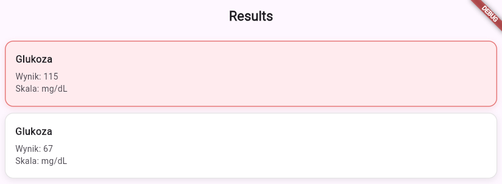

## About MedApp

MedApp is a medical data management system that integrates data from various medical laboratories and presents it to healthcare professionals through a mobile/desktop application.

- **Backend** – A C# ASP.NET Core Minimal API that serves as a centralized hub for accessing, managing, and processing laboratory results and patient information from multiple sources.
- **Frontend** – A Flutter-based application that communicates with the backend API to display patient information and medical results in a user-friendly interface, with real-time critical condition detection.

## MedApp



---

## Current Features

✅ **Read data from JSON files** (laboratory results, patient information, etc.)

✅ **Patient List View** – Displays a comprehensive list of all patients with relevant medical information

✅ **Critical Condition Recognition System** – Automatically detects critical patient conditions and highlights affected patient tiles in red for immediate visibility

✅ **Real-time API Communication** – Establishes connection with the backend service to fetch the latest patient and results data

## Planned Features

🔄 **Support for additional file formats:** CSV, TXT, XML

🔄 **Enhanced data validation and error handling**

🔄 **Advanced Patient Filtering** – Filter patients by PESEL, surname, first name, and other identifiers

🔄 **Enhanced Patient Condition Recognition** – Yellow highlighting for warning conditions, additional severity levels and visual indicators

---

## JSON Schema

```json
{
  "patient_id": "string (unique identifier)",
  "patient_name": "string",
  "patient_surname": "string",
  "test_name": "string",
  "result": "double",
  "scale": "string"
}
```


## Requirements

### Backend
- **C#** 10.0 or higher
- **.NET** 6.0 or higher

### Frontend
- **Flutter** 3.0.0 or higher
- **Dart** 3.0.0 or higher
- `http` package (defined in `pubspec.yaml`)

---

## How to Run

### Backend

1. Install the .NET SDK from [dotnet.microsoft.com/download](https://dotnet.microsoft.com/download)

2. Navigate to the Backend directory:
   ```bash
   cd Backend
   ```

3. Restore dependencies:
   ```bash
   dotnet restore
   ```

4. Build and run:
   ```bash
   dotnet build
   dotnet run
   ```

5. The API will be available at `http://localhost:5000` (or as shown in console output).

### Frontend

1. Ensure Flutter and Dart are installed:
   ```bash
   flutter --version
   dart --version
   ```

2. Navigate to the frontend directory:
   ```bash
   cd frontend
   ```

3. Install dependencies:
   ```bash
   flutter pub get
   ```

4. Run the application:
   ```bash
   flutter run -d <device>
   ```

   **Available devices:** `android`, `ios`, `web`, `windows`, `macos`, `linux`

   To list connected devices:
   ```bash
   flutter devices
   ```

---

## Recommended Extensions

- [C# for Visual Studio Code (OmniSharp)](https://marketplace.visualstudio.com/items?itemName=ms-dotnettools.csharp)
- [REST Client](https://marketplace.visualstudio.com/items?itemName=humao.rest-client) – for testing API endpoints
- [NuGet Package Manager](https://marketplace.visualstudio.com/items?itemName=jmrog.vscode-nuget-package-manager)
